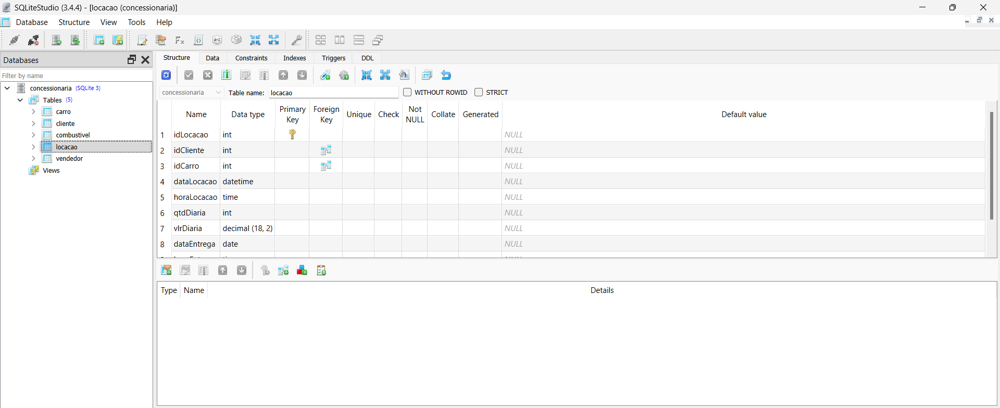
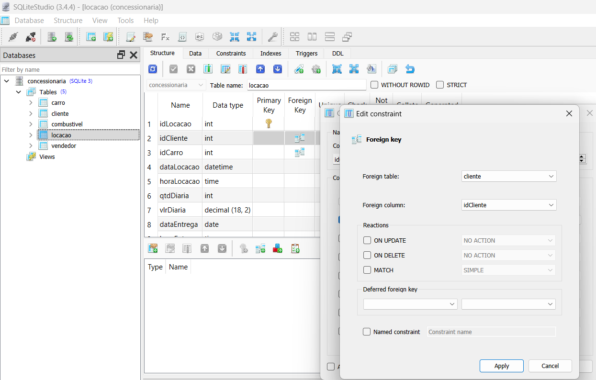
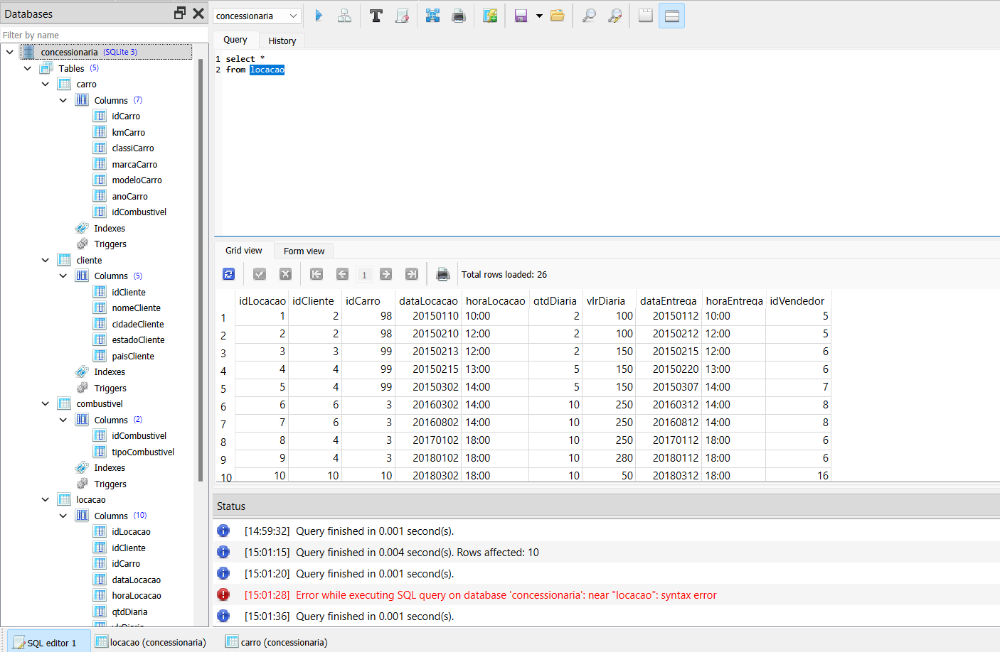

## Exercício de Normalização de Dados

##### Explicação passo a passo como foi feito

1. Ao iniciar o banco de dados no SQLite Studio, foi criado as tabelas cliente, combustivel, vendedor, carro e renomeio da tabela tb_locacao para locacao. 
```sql 
# Exemplo de código na criação de tabela
CREATE TABLE cliente (
    idCliente INT PRIMARY KEY,
    nomeCliente VARCHAR (100),
    cidadeCliente VARCHAR (40),
    estadoCliente VARCHAR (40),
    paisCliente VARCHAR (40)
)
```
2. Após a criação das tabelas, os dados da tabela locacao, foram copiados para cada coluna nas demais tabela.
```sql
# Exemplo de código utilizado na transferência dos dados de uma coluna da tabela locacao, para outra coluna em outra tabela.
INSERT OR IGNORE INTO cliente (idCliente, nomeCliente, cidadeCliente, estadoCliente, paisCliente)
SELECT DISTINCT idCliente, nomeCliente, cidadeCliente, estadoCliente, paisCliente
FROM locacao;
```

3. Ao transferir os dados para suas respectivas colunas e tabelas, deletei algumas colunas da tabela locacao
```sql
# exemplo de código utilizado para exclusão de uma coluna, da tabela locacao.
DROP COLUMN nomeCliente
FROM locacao
```

4. Utilizei as configurações do SQLite Studio para determinar quais colunas seriam chave estrangeira e suas respectivas referências.<br>
**Segue abaixo exemplo:**



5. Banco de dados normalizado 
